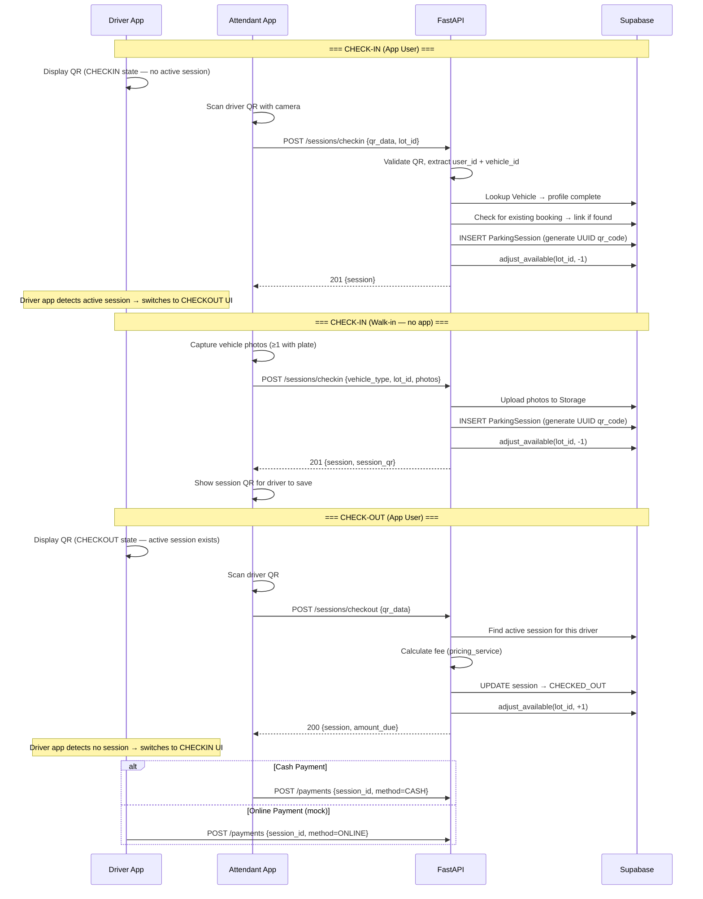
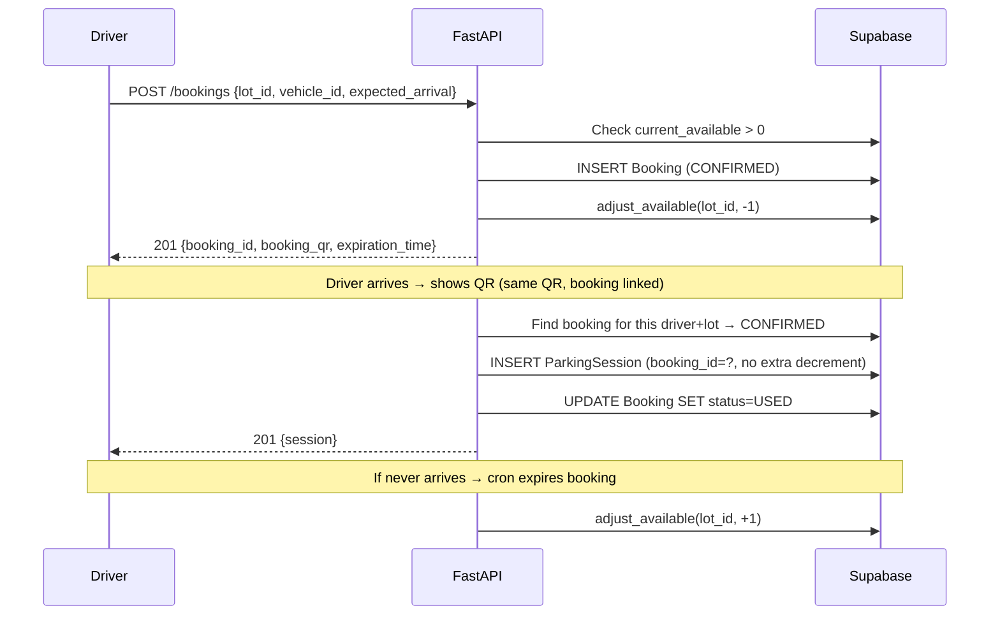
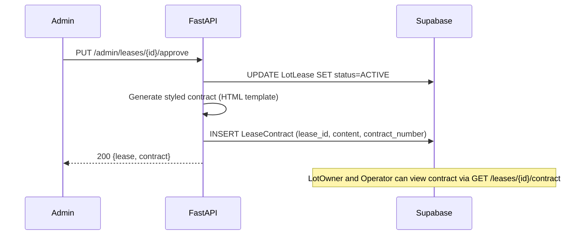

# Architecture Document — Smart Parking Management System

**Author:** Khoa
**Date:** 2026-03-20
**Based on:** [PRD](file:///d:/Code/thesis/_bmad-output/prd.md) · [ERD](file:///d:/Code/thesis/doc/erd.md) · [Reference](file:///d:/Code/thesis/doc/reference.md) · [Use Cases](file:///d:/Code/thesis/doc/usecase.md)

---

## 1. System Overview

A mobile-first platform with three tiers: a **React Native** client (UI only), a **FastAPI** backend (all logic + Supabase integration), and **Supabase** (Auth + PostgreSQL + RLS + Realtime + Storage + Edge Functions).

**All client requests go through FastAPI.** React Native never talks to Supabase directly. This keeps the mobile codebase thin and all logic centralized.

```
┌─────────────────────────────────────────────────────────────┐
│                     React Native (Expo)                     │
│  ┌──────────┐ ┌──────────┐ ┌──────────┐ ┌───────────────┐  │
│  │  Driver   │ │Attendant │ │ Operator │ │LotOwner/Admin │  │
│  │  Screens  │ │ Screens  │ │ Screens  │ │   Screens     │  │
│  └──────────┘ └──────────┘ └──────────┘ └───────────────┘  │
│         Camera · Map · QR Scanner · Push Notifications      │
└─────────────────────────┬───────────────────────────────────┘
                          │ HTTPS (Supabase JWT)
                          │ ALL requests
                          ▼
┌─────────────────────────────────────────────────────────────┐
│                   FastAPI Backend (uv)                       │
│  ┌────────┐ ┌────────┐ ┌─────────┐ ┌───────┐ ┌──────────┐ │
│  │  Auth  │ │  Lots  │ │Sessions │ │Booking│ │  Admin   │ │
│  │ Proxy  │ │ Router │ │ Router  │ │Router │ │  Router  │ │
│  └────────┘ └────────┘ └─────────┘ └───────┘ └──────────┘ │
│  Services · QR Engine · Fee Calc · Contract Gen             │
└─────────────────────────┬───────────────────────────────────┘
                          │ Supabase SDK (service key)
                          ▼
┌─────────────────────────────────────────────────────────────┐
│                        Supabase                              │
│  ┌────────┐ ┌──────────┐ ┌────────┐ ┌────────┐ ┌────────┐ │
│  │  Auth  │ │PostgreSQL│ │Realtime│ │Storage │ │  Edge  │ │
│  │(Google)│ │ 23 tbls  │ │        │ │(images)│ │  Funcs │ │
│  │        │ │  + RLS   │ │        │ │        │ │        │ │
│  └────────┘ └──────────┘ └────────┘ └────────┘ └────────┘ │
└─────────────────────────────────────────────────────────────┘
```

> **Terminology:** "Operator" (product term) = `Manager` (ERD/database term). See PRD §Project Classification.

---

## 2. Component Architecture

### 2.1 Mobile Client — React Native (Expo)

**Pure frontend.** Renders UI, captures user input, displays data. All data comes from FastAPI. Auth via FastAPI `/auth/*` endpoints which proxy to Supabase Auth.

| Role | Key Screens |
|------|-------------|
| Driver | Map, Lot Detail, Booking, QR (state machine), History, Profile |
| Attendant | Lot Dashboard, QR Scanner, Session List, Photo Capture |
| Operator | Lot Config, Pricing, Announcements, Revenue, Attendants |
| LotOwner | My Lots, Lease Listings, Contracts |
| Admin | Lot Approvals, Lease Approvals, Users |

**Key Libraries (Expo-compatible):**

| Capability | Library |
|------------|---------|
| Navigation | `expo-router` |
| Camera / QR | `expo-camera` (QR scanning mode) |
| Maps | `@rnmapbox/maps` (Mapbox natively) |
| HTTP client | `axios` with JWT interceptor |
| State | `zustand` for local, TanStack Query for remote |
| UI Library | `NativeWind v4` (Tailwind styling) |
| UX/UI Design | Google Stitch (connected via MCP server) |
| Image picker | `expo-image-picker` |
| Secure storage | `expo-secure-store` (JWT tokens) |

### 2.2 Backend — FastAPI

FastAPI is the **single gateway** between client and Supabase. It proxies auth, handles all business logic, and manages Supabase interactions using the **service key** (bypasses RLS for server-side operations).

**Architecture & Tools:**
- **Monolith:** Clean single-service architecture, no microservices overhead.
- **Boilerplate:** Built upon [fastapi-boilerplate](https://github.com/benavlabs/fastapi-boilerplate). The boilerplate originally uses standard PostgreSQL with Docker and Alembic, but it will be refined to connect and migrate against **Supabase** in the cloud.

**Project structure:**

```
backend/
├── app/
│   ├── main.py                 # FastAPI app, CORS, Realtime WebSocket proxy
│   ├── core/
│   │   ├── config.py           # Environment vars, Supabase URL/keys
│   │   ├── security.py         # Supabase JWT validation
│   │   └── dependencies.py     # get_current_user, require_role()
│   ├── routers/
│   │   ├── auth.py             # Proxy: register, login (Google), refresh, me
│   │   ├── parking_lots.py     # CRUD lots, configs, pricing, tags
│   │   ├── sessions.py         # Check-in, check-out, session edits
│   │   ├── bookings.py         # Create, cancel bookings
│   │   ├── payments.py         # Record cash, mock online payment
│   │   ├── users.py            # Profile, vehicles
│   │   ├── leases.py           # Lot registration, leasing, contracts
│   │   ├── announcements.py    # Lot announcements CRUD
│   │   ├── attendants.py       # Operator manages attendants
│   │   └── reports.py          # Revenue, occupancy reports
│   ├── models/
│   │   └── schemas.py          # Pydantic request/response models
│   ├── services/
│   │   ├── parking_service.py  # current_available logic
│   │   ├── qr_service.py       # QR generation & validation
│   │   ├── pricing_service.py  # Fee calculation engine
│   │   ├── booking_service.py  # Expiration, slot hold logic
│   │   └── contract_service.py # Lease contract generation (HTML)
│   └── db/
│       └── supabase.py         # Supabase client init (service key)
├── pyproject.toml
└── .env
```

**Auth proxy pattern:**

```python
@router.post("/auth/login")
async def login(data: LoginRequest):
    """Proxy to Supabase Auth, return JWT to mobile client."""
    result = supabase.auth.sign_in_with_password({
        "email": data.email,
        "password": data.password
    })
    return {"access_token": result.session.access_token, ...}

@router.post("/auth/login/google")
async def login_google(data: GoogleTokenRequest):
    """Exchange Google ID token via Supabase Auth."""
    result = supabase.auth.sign_in_with_id_token({
        "provider": "google",
        "token": data.id_token
    })
    return {"access_token": result.session.access_token, ...}
```

**RBAC via `require_role()` dependency:**

```python
@router.post("/sessions/checkin")
async def checkin(
    data: CheckinRequest,
    user: User = Depends(require_role(["ATTENDANT"]))
):
    """require_role() validates Supabase JWT and checks user.role"""
    ...
```

> `require_role()` decodes the Supabase JWT using the project's JWT secret, extracts `user_id` and looks up `User.role` from the database. This is FastAPI-level enforcement on top of Supabase RLS.

#### 2.2.1 Atomicity & Registration Strategy
To satisfy **NFR15 (Reliability: No data loss)**, user registration must be atomic across Supabase Auth and the `public.user` table. 
- **Pattern**: Postgres Trigger on `auth.users`.
- **Rationale**: Manual API-side insertion is vulnerable to networked-induced partial failures (Auth succeeds, DB fails). Trigger-based sync ensures that the database record is created within the same transaction lifecycle as the Auth user.
- **Rollback**: If the trigger fails, Supabase Auth prevents the user creation entirely.

### 2.3 Data Layer — Supabase

- **Auth:** Supabase Auth with email/password and Google sign-in. FastAPI proxies all auth calls. JWTs are signed by Supabase using the project JWT secret.
- **PostgreSQL + RLS:** 23 tables (ERD). RLS policies as a defense-in-depth layer. FastAPI uses the service key for all operations.
- **Realtime:** `parking_lot.current_available` changes are pushed via Supabase Realtime. FastAPI can forward these via WebSocket or SSE to connected clients.
- **Storage:** Bucket `parking-images`. Photos uploaded from mobile → FastAPI → Supabase Storage.
- **Edge Functions:** `process-payment` — mock in MVP.
- **Scheduled Functions:** `expire-bookings` cron job (every minute).

#### RLS as Defense-in-Depth

RLS policies remain active even though FastAPI uses the service key — they protect against direct database access and provide a second layer of security:

```sql
-- Drivers only see their own sessions
CREATE POLICY "drivers_read_own_sessions" ON parking_session
  FOR SELECT USING (
    driver_id = (SELECT driver_id FROM driver WHERE user_id = auth.uid())
  );

-- Operators can only modify their leased lots
CREATE POLICY "operators_manage_own_lots" ON parking_lot
  FOR UPDATE USING (
    parking_lot_id IN (
      SELECT parking_lot_id FROM lot_lease
      WHERE manager_id = (SELECT manager_id FROM manager WHERE user_id = auth.uid())
        AND status = 'ACTIVE'
    )
  );

-- Public: anyone can see approved lots
CREATE POLICY "public_read_approved_lots" ON parking_lot
  FOR SELECT USING (status = 'APPROVED');
```

---

## 3. Core Data Flows

### 3.1 Driver QR — State Machine

The driver has **one persistent QR code** displayed in their app. Its behavior changes based on whether an active session exists:

```
┌─────────────────────────────────────────────────────────┐
│              Driver QR State Machine                    │
├─────────────────────────────────────────────────────────┤
│                                                         │
│   ┌───────────┐   Attendant scans    ┌───────────┐     │
│   │  CHECKIN   │ ──────────────────→  │  CHECKOUT  │     │
│   │   state    │   session created    │   state    │     │
│   │           │                      │           │     │
│   │ QR = {     │                      │ QR = same  │     │
│   │  user_id,  │                      │ but API    │     │
│   │  vehicle_id│                      │ recognizes │     │
│   │  ts }      │                      │ active     │     │
│   │           │   session ends       │ session    │     │
│   │           │ ←──────────────────  │           │     │
│   └───────────┘   (checkout/expire)  └───────────┘     │
│                                                         │
│   The QR content stays the same — the backend           │
│   determines state by checking for active session.      │
│                                                         │
│   Walk-in (no app): attendant captures photos,          │
│   system generates a session UUID QR for checkout.      │
│                                                         │
└─────────────────────────────────────────────────────────┘
```

**How it works:**
1. Driver shows their QR (always contains `{ user_id, vehicle_id, ts }`)
2. Attendant scans → `POST /sessions/checkin`
3. Backend checks: does this driver have an active session at this lot?
   - **No active session** → create new `ParkingSession` → respond "checked in"
   - **Active session exists** → `POST /sessions/checkout` → calculate fee → respond "checked out"
4. Driver app queries their active session status to show the appropriate UI (check-in vs checkout screen)

### 3.2 Check-In / Check-Out Sequence



### 3.3 `current_available` — Realtime Sync

**Write path:** Atomic RPC function called by FastAPI.

```sql
CREATE OR REPLACE FUNCTION adjust_available(p_lot_id INT, p_delta INT)
RETURNS VOID AS $$
BEGIN
    UPDATE parking_lot
    SET current_available = GREATEST(0, current_available + p_delta),
        updated_at = NOW()
    WHERE parking_lot_id = p_lot_id;
END;
$$ LANGUAGE plpgsql;
```

| Event | Delta | Called From |
|-------|-------|-------------|
| Check-in | -1 | `POST /sessions/checkin` |
| Check-out | +1 | `POST /sessions/checkout` |
| Booking confirmed | -1 | `POST /bookings` |
| Booking cancelled | +1 | `POST /bookings/{id}/cancel` |
| Booking expired | +1 | `expire-bookings` cron |

**Read path:** FastAPI forwards Supabase Realtime changes to connected clients via **WebSocket** or **Server-Sent Events (SSE)**:

```python
# FastAPI WebSocket endpoint for real-time availability
@app.websocket("/ws/availability")
async def availability_ws(websocket: WebSocket, lot_ids: str):
    await websocket.accept()
    # Subscribe to Supabase Realtime for the requested lots
    channel = supabase.channel('lot-updates')
    channel.on('postgres_changes', {
        'event': 'UPDATE', 'schema': 'public', 'table': 'parking_lot'
    }, lambda payload: asyncio.create_task(
        websocket.send_json(payload['new'])
    ))
    await channel.subscribe()
```

### 3.4 Booking → Session Conversion



### 3.5 Fee Calculation Engine

```python
async def calculate_fee(session: ParkingSession) -> FeeBreakdown:
    """
    1. Look up active Pricing for lot + vehicle_type
       WHERE effective_from <= today AND (effective_to IS NULL OR effective_to >= today)
    
    2. Read pricing_mode:
       - SESSION: fee = price_amount (flat)
       - HOURLY: fee = price_amount × ceil(duration_hours)
       - DAILY / MONTHLY / CUSTOM: Phase Expansion
    
    3. Return FeeBreakdown(amount, pricing_mode, duration)
    """
```

### 3.6 Lease Contract Auto-Generation



> **MVP:** Styled HTML contract viewable in-app. PDF export deferred.

---

## 4. API Design

### 4.1 Conventions

```
Base URL: https://{host}/api/v1
Content-Type: application/json
Auth: Bearer {supabase_jwt} in Authorization header
```

**Response format:**
```json
{ "data": { ... }, "message": "Success", "status": 200 }
```

### 4.2 All Endpoints (FastAPI Gateway)

#### Auth (Supabase Auth proxy)
```
POST   /auth/register           # Email/password registration
POST   /auth/login              # Email/password login → JWT
POST   /auth/login/google       # Google ID token exchange → JWT
POST   /auth/refresh            # Refresh access token
GET    /auth/me                 # Current user profile
```

#### Parking Lots
```
GET    /lots                    # List lots (filters: lat, lng, radius, vehicle_type, tags)
GET    /lots/{id}               # Lot detail + config + pricing + tags + announcements
PUT    /lots/{id}               # Update lot (Operator)
POST   /lots/{id}/configs       # New config version (Operator)
POST   /lots/{id}/pricing       # New pricing record (Operator)
GET    /lots/{id}/stats         # Capacity stats (Attendant, Operator)
```

#### Sessions
```
POST   /sessions/checkin        # QR scan or walk-in photo capture
POST   /sessions/checkout       # QR scan → fee calculation
GET    /sessions                # List (Attendant: by lot, Driver: own)
GET    /sessions/{id}           # Detail
PUT    /sessions/{id}           # Edit (creates SessionEdit)
POST   /sessions/{id}/photos    # Upload check-in/checkout photos
```

#### Bookings
```
POST   /bookings                # Create booking
GET    /bookings                # List own bookings
DELETE /bookings/{id}           # Cancel booking
```

#### Payments
```
POST   /payments                # Record cash or mock online
GET    /payments                # List (Driver: own, Operator: by lot)
GET    /payments/{id}           # Detail
```

#### Users & Vehicles
```
GET    /users/me                # Profile
PUT    /users/me                # Update profile
GET    /users/me/vehicles       # List vehicles
POST   /users/me/vehicles       # Register vehicle
PUT    /users/me/vehicles/{id}  # Update vehicle
```

#### Leases & Contracts
```
POST   /lots/register           # LotOwner registers a lot
POST   /lots/{id}/lease-listing # LotOwner posts for lease
POST   /leases                  # Operator applies to lease
GET    /leases                  # List leases
GET    /leases/{id}/contract    # View auto-generated contract
```

#### Announcements
```
GET    /lots/{id}/announcements        # List (public)
POST   /lots/{id}/announcements        # Create (Operator)
PUT    /lots/{id}/announcements/{aid}  # Update (Operator)
DELETE /lots/{id}/announcements/{aid}  # Delete (Operator)
```

#### Attendant Management (Operator)
```
GET    /lots/{id}/attendants       # List
POST   /lots/{id}/attendants       # Add
DELETE /lots/{id}/attendants/{uid} # Remove
```

#### Admin
```
PUT    /admin/lots/{id}/approve     # Approve/reject lot
PUT    /admin/leases/{id}/approve   # Approve/reject lease → auto-generate contract
GET    /admin/users                 # Search users
PUT    /admin/users/{id}            # Activate/deactivate
```

#### Reports
```
GET    /lots/{id}/reports           # Revenue, occupancy
```

#### Realtime
```
WS     /ws/availability             # WebSocket: lot availability updates
```

---

## 5. Security Architecture

```
┌──────────────┐                     ┌──────────────────────┐
│  Mobile App  │                     │      Supabase        │
│              │                     │  ┌────────────────┐  │
│  expo-secure │                     │  │ Auth (Google+  │  │
│  -store      │                     │  │  email/pass)   │  │
│  (JWT)       │                     │  ├────────────────┤  │
│              │────── HTTPS ──────→ │  │ PostgreSQL     │  │
│              │  ALL via FastAPI    │  │  23 tbls + RLS │  │
└──────────────┘                     │  ├────────────────┤  │
       ↕                             │  │ Realtime       │  │
┌──────────────┐                     │  ├────────────────┤  │
│   FastAPI    │──── Service Key ──→ │  │ Storage        │  │
│ (all logic)  │  + JWT Secret       │  └────────────────┘  │
│              │  (for validation)   │                      │
└──────────────┘                     └──────────────────────┘
```

| Concern | Implementation |
|---------|---------------|
| Auth provider | **Supabase Auth** — email/password + Google sign-in, proxied via FastAPI |
| JWT validation | FastAPI decodes Supabase JWT using project's **JWT secret** to extract `user_id` and `role` |
| Token lifecycle | Supabase issues access + refresh tokens; FastAPI proxy handles refresh |
| Token storage | `expo-secure-store` on mobile |
| RBAC | `require_role()` FastAPI dependency (checks `User.role` from DB) **+ Supabase RLS** as defense-in-depth |
| QR security | UUID v4 (122 bits entropy), unique per session |
| Image upload | Mobile → FastAPI → Supabase Storage (no direct client upload) |
| Input validation | Pydantic models on all request bodies |

---

## 6. Pricing Model

The `Pricing` table uses `pricing_mode` for flexible pricing:

| Mode | Calculation | MVP |
|------|-------------|-----|
| `SESSION` | Flat rate per parking session | ✅ |
| `HOURLY` | `price_amount × ceil(hours)` | ✅ |
| `DAILY` | Flat rate per calendar day | Phase Expansion |
| `MONTHLY` | Flat rate per month (passes) | Phase Expansion |
| `CUSTOM` | Operator-defined rules | Phase Expansion |

---

## 7. Infrastructure & Deployment

| Component | Deployment |
|-----------|-----------|
| Mobile app | Expo Go on Android device/emulator |
| FastAPI backend | Local Docker Compose (from boilerplate) |
| Supabase | Supabase Cloud (managed via MCP server) |
| Database GUI | Supabase Cloud Studio |
| Map tiles | Mapbox natively via `@rnmapbox/maps` |

### Environment Variables

```env
# Backend (.env)
SUPABASE_URL=https://xxx.supabase.co
SUPABASE_SERVICE_KEY=eyJ...              # bypasses RLS
SUPABASE_JWT_SECRET=<project-jwt-secret> # to validate client JWTs
```

```env
# Mobile (app.config.js / .env)
API_BASE_URL=http://192.168.x.x:8000/api/v1
MAPBOX_ACCESS_TOKEN=pk.eyJ...
```

> Mobile app only needs the FastAPI URL — no Supabase credentials on client.

---

## 8. Decisions & Trade-offs

| Decision | Rationale |
|----------|-----------|
| **Full FastAPI gateway** | Centralizes logic, keeps mobile thin, avoids SDK overhead. |
| **Trigger-based Registration** | Ensures atomicity between Auth and DB (NFR15). Replaces manual API inserts. |
| **Supabase Auth via proxy** | FastAPI auth endpoints call Supabase Auth under the hood. |
| **`require_role()` + RLS** (dual RBAC) | FastAPI checks role at endpoint level. RLS provides defense-in-depth at DB level. Belt and suspenders. |
| **Driver QR state machine** | One QR, two states (CHECKIN/CHECKOUT). Backend determines state by checking for active session. No QR regeneration needed. |
| **Attendant scans driver QR** (MVP) | Simplest flow. Driver scanning lot QR is future/IoT scope for self-service check-in. |
| **Flexible `pricing_mode`** | Future-proofs for daily/monthly/custom. MVP ships SESSION + HOURLY. |
| **LeaseContract entity** (ERD table 23) | Separate from LotLease for BCNF. Auto-generated HTML on lease approval. |
| **Styled contract, not PDF** in MVP | PDF generation deferred. In-app styled HTML sufficient for thesis demo. |
| **Mock online payment** | Demonstrates flow without Stripe/Momo API keys. |
| **Mapbox** | Better RN support, free tier sufficient. |

---

## 9. Open Items for Tech Design

- [ ] Complete RLS policies for all 23 tables
- [ ] Pydantic schema definitions for all endpoints
- [ ] Database migration strategy (Supabase migrations or raw SQL)
- [ ] WebSocket/SSE implementation for Realtime forwarding
- [ ] Map clustering for lots when zoomed out
- [ ] Booking expiration: `pg_cron` vs Supabase scheduled function
- [ ] Error code catalog
- [ ] Pagination strategy (cursor vs offset)
- [ ] Contract HTML template design
- [ ] Walk-in session: how `license_plate` field is handled when no plate is entered (nullable? extracted from photo metadata?)
