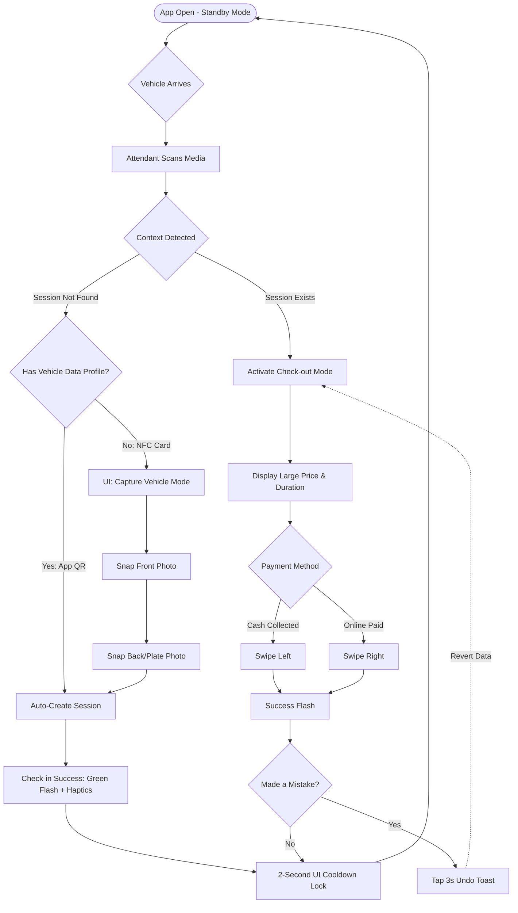
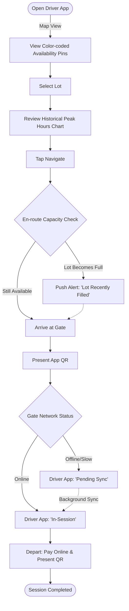
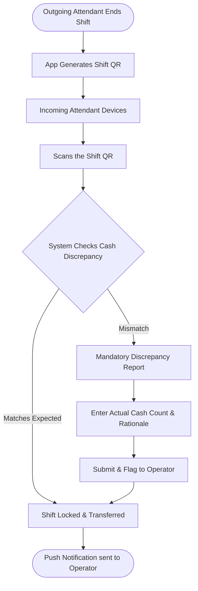

---
stepsCompleted:
  - 1
  - 2
  - 3
  - 4
  - 5
  - 6
  - 7
  - 8
  - 9
  - 10
  - 11
  - 12
  - 13
  - 14
inputDocuments:
  - "prd.md"
  - "architecture.md"
  - "tech-design.md"
  - "planning-artifacts/epics.md"
  - "planning-artifacts/epic-0.md"
---

# UX Design Specification thesis

**Author:** Khoa
**Date:** 2026-03-27

---

<!-- UX design content will be appended sequentially through collaborative workflow steps -->

## Executive Summary

### Project Vision
Smart Parking Management System is a mobile-first platform aimed at digitizing the parking ecosystem in Vietnam. The platform entirely replaces traditional kiosk infrastructure (NFC cards, PCs, cameras) with a smartphone application (with fallback NFC card support). It connects Lot Owners, Operators, Attendants, and Drivers into a unified marketplace, providing ultra-fast QR/NFC check-in/out, real-time availability mapping, and online payments.

### Target Users
- **Driver:** Needs to find parking quickly, check prices and availability in advance. Prioritizes app convenience (QR scanning, online payment). *(Walk-in/offline guests use NFC cards).*
- **Attendant:** Operates directly at the gate. Requires a minimalist interface on an NFC-supported device to scan QR/NFC and capture license plates instantly to release vehicles without causing congestion.
- **Operator:** Manages lots, pricing, and revenue. Needs strict financial reconciliation systems (cash vs. online transfers) with absolute accuracy.
- **LotOwner:** Needs a platform to list parking spaces, find tenant operators, and manage lease contracts.

### Key Design Challenges
- **Ultra-High-Speed Interaction:** Check-in/out operations must take < 5 seconds to prevent traffic jams. Requires a UI that clearly distinguishes between entry and exit scanning modes, combined with strict backend optimization (caching) to meet latency SLAs.
- **Network Disruption Risk (Offline Mode):** Designing a seamless fallback experience using traditional NFC cards for users without the app or during internet outages, ensuring the parking lot is never bottlenecked.
- **High Information Density on Small Screens:** Displaying availability, pricing, and amenities clearly on a mobile map without cluttering the driver's view.
- **Complex Role Switching:** Providing intuitive navigation between the core driver interface and management spaces (for Lot Owners/Operators) within a single public account lifecycle.

### Design Opportunities
- **2-in-1 Standby Interface:** The camera (for QR) and NFC sensor are always awake on a single screen. The UI provides extremely clear mode-switching buttons ("Vehicle Entry" / "Vehicle Exit") so attendants can prepare their actions flawlessly.
- **No-Look Environment (Haptic Feedback):** Optimizing system feedback using diverse haptic vibrations upon successful scans. Attendants optionally communicate prices verbally instead of relying on text-to-speech, and can toggle hardware shortcuts (e.g., volume buttons) based on ergonomic preferences.
- **QR Shift Handover:** Building a transparent shift-closing module using internal QR codes. The outgoing attendant generates a shift QR summarizing cash collected; the incoming attendant scans it to confirm the handover, nullifying financial discrepancies.
- **Real-Time Feedback:** Color-coded availability indicators on the map build visual trust for drivers.

## Core User Experience

### Defining Experience
The most critical action determining the system's viability is the **Check-in/Check-out flow**. This process must complete in under 5 seconds regardless of poor network conditions, effectively mitigating latency via Asynchronous Sync and Local Caching on the attendant's device.

### Platform Strategy
- **Primary Platform:** Mobile application (Flutter) prioritizing Android for the MVP.
- **Operation Model:** Phone-as-Kiosk (smartphones replace all kiosk hardware).
- **Hardware Requirements:** Attendant devices must possess high-speed cameras (for QR) and NFC sensors (for fallback/walk-ins).

### Effortless Interactions
- **Universal Recognition:** The attendant's scanning interface is an always-awake screen ready to accept either a QR code or an NFC tap simultaneously.
- **Zero-Trust Shift Handover:** Cash funds are transferred via a "Shift QR". Crucially, a **Discrepancy Reporting UX** allows the incoming attendant to input actual cash amounts if they differ from the system, immediately locking the shift and sending a push notification alert to the Operator.
- **Sync Reassurance (Parking Discovery):** Drivers see a **"Pending Sync"** UI state to alleviate anxiety about losing their parking session if the lot's device operations are delayed or offline.

### Critical Success Moments
- **In the Vehicle:** A driver looking for a spot is reassured by the "Pending Sync" UI, preventing app-anxiety.
- **At the Gate:** An attendant effortlessly processes 10 vehicles per minute using "no-look haptics" under glaring sunlight.
- **At Home:** An Operator breathes easy as end-of-day cash reports match system records perfectly.

### Experience Principles
- **Speed over Depth:** At the parking gate, time is money. Every check-in/out UI must eliminate redundant confirmations and maximize hit areas.
- **No-look Reliability:** Strong haptic vibrations and visual edge flashes serve as secondary feedback channels in harsh working environments.
- **Clear Financial Boundaries:** UX elements dealing with cash flow (cash vs. digital payment) must be color-separated, use large typography, and be strictly distinct to prevent reconciliation errors.

## Desired Emotional Response

### Primary Emotional Goals
- **Drivers:** Feel "Relieved and Confident". They know exactly where to park and feel in control of their time without fumbling for cash.
- **Attendants:** Feel "Empowered and Efficient". Their smartphone becomes a high-speed tool that clears queues instantly, without the stress of deciphering small buttons under glaring sunlight.
- **Operators:** Feel "Secure and In Control". They have absolute trust in the financial numbers.

### Emotional Journey Mapping
- **Discovery:** Relief ("Finally, a guaranteed spot near my destination").
- **Core Action:** Effortless flow ("Wow, that was fast. I didn't even have to stop my bike fully").
- **Completion:** Satisfaction với zero friction.
- **Return:** Habitual trust ("I don't need to think about parking anymore, I just use the app").

### Micro-Emotions
- **Confidence > Confusion:** Immediate, unambiguous multi-sensory feedback (haptic & audio) when scanning, so users never wonder if the scan was successful.
- **Trust > Skepticism:** Complete confidence in shift handover numbers.
- **"Secured" Mental State:** Once a driver books a spot, the UI visibly shifts into a "Secured" mode (with a countdown timer), mentally reassuring them that the spot is theirs.

### Design Implications
- **Goal: Empowered/Efficient (Attendants)** → **UX Implementation:** "Swipe-to-Resolve" Checkout UI. Instead of tapping small buttons to confirm payment methods, attendants simply swipe the entire screen left for "Cash Collected" or right for "Online Paid". This eliminates fat-finger mistakes.
- **Goal: Relieved (Drivers)** → **UX Implementation:** "Pending Sync" UI. If there's network latency at the gate, drivers see an honest "Pending Sync" status rather than a missing session, preserving their trust.
- **Goal: Secure (Operators)** → **UX Implementation:** The "Discrepancy Report" screen during shift handovers must adopt a serious, high-contrast visual language (red/yellow warnings) to emphasize its financial importance.

### Emotional Design Principles
- **Clear over Clever:** Use explicit text and large hit areas rather than clever but ambiguous icons.
- **Feedback is Oxygen:** Every gate action must provide instant sensory feedback (sight, sound, touch).
- **Respect the Stress:** Drivers in traffic and attendants in the heat are stressed. The application must be the calmest, most predictable part of their day.

## UX Pattern Analysis & Inspiration

### Inspiring Products Analysis
- **Grab (Driver Context):** Excels in its "Operation on the saddle" philosophy. It uses massive action buttons (Hero Buttons), vibrant colors (Green), and an extremely linear interaction flow that ensures drivers never misclick, even while moving.
- **MoMo (Payment/Scanning Context):** Mastering "Speed and Feedback". The QR scanning experience opens the camera instantly (zero-latency). The most valuable element is the distinct audio ("ting") and UI animation immediately upon a successful transaction, completely eliminating disputes about whether money was transferred.
- **Google Maps (Navigation Context):** Demonstrates "Multi-layered but Organized Maps". It uses color-coding to show traffic density effectively. Minimalist voice search saves typing time for drivers.

### Transferable UX Patterns
**1. Interaction Patterns:**
- **Single-Tap Full-Width Buttons (from Grab):** Applied to the "Book Now" or "Open Map" actions for Drivers, positioned at the bottom edge (Thumb-zone) for immediate accessibility.
- **Zero-Latency Scanner & Audio Cue (from MoMo):** Directly transplanting the ultra-fast QR scanning concept + Audio confirmation (Beeps) + Green Screen Flash into the Attendant Check-in/Check-out flow.

**2. Visual & Navigation Patterns:**
- **Color-Coded Pins (from Google Maps):** Parking lot markers on the map will use colors (Green = Many spots available, Orange = Filling up, Red = Full) instead of forcing users to read tiny numbers while driving.
- **Map Clustering:** Grouping map points when zoomed out to optimize rendering performance and maintain a clean driver UI, expanding into individual color-coded pins only upon zooming in.

### Anti-Patterns to Avoid
Based on lessons from these successful apps, we must strictly ban the following UX patterns:
- **Silent Success/Failure (The "Black Hole" UI):** Scanning a code where the app processes it silently without audio or haptic feedback. This leads attendants to scan twice out of doubt, corrupting data.
- **Multi-step Confirmation Dialogs:** Blocking check-in/out with "Are you sure?" popups. The strict 5-second SLA forbids redundant friction.
- **Hidden Core Actions:** Burying the QR scanner or Map Search behind Hamburger Menus (≡). These core functions must be universally exposed on the main screens.

### Design Inspiration Strategy
- **Adopt:** MoMo's split-second UX scanner capabilities bundled with its immediate Audio/Color feedback for the Attendant application.
- **Adapt:** Combine Google Maps' color-coded clustering and Grab's massive, thumb-friendly buttons for a foolproof Driver application.
- **Avoid:** Completely eliminate text-heavy forms and silent feedback loops during the active physical operations of the parking lot.
- **Innovate (Cooldown UI Lock):** Drawing inspiration from POS terminals, implement a 2-second "lens lockdown" (Cooldown UI) immediately after a successful scan to prevent accidental double-scans of adjacent vehicles in chaotic environments.

## Design System Foundation

### 1.1 Design System Choice
- **System:** Established System - Material Design 3 (MD3).
- **Core Framework:** Native Flutter Material Library.

### Rationale for Selection
- **Speed to MVP:** We need to deliver a functional, high-speed parking application với a very narrow focus on the core "Check-in/Check-out" SLA (< 5s). Building bespoke UI components would drastically delay the MVP project timeline.
- **Platform Alignment:** Android is the prioritized platform for the MVP, and Material Design 3 provides native, highly optimized widgets that feel completely natural and responsive to the end user.
- **Built-in accessibility & ergonomics:** MD3 handles touch targets, contrast ratios, and ripple haptics out-of-the-box, ensuring we don't need to rebuild foundational mobile sensory experiences.

### Implementation Approach
- **Out-of-the-box UI Construction:** Use standard Flutter Widgets (`Scaffold`, `FloatingActionButton`, `Card`, `BottomSheet`, `SnackBar`) to map the structural UI rapidly, allowing developers to focus strictly on complex backend offline-caching logic rather than custom UI painting.
- **Micro-Overrides:** We will strategically break away from strict MD3 patterns only where the UX requires it for core SLAs (e.g., the Full-Screen "Extreme Visual State" color flashes and the "Swipe-to-Resolve" actions, pushing beyond standard Material button constraints).

### Customization Strategy
- **Micro-Themes (Global Palette):** Use the `ThemeData` class in Flutter to strictly map our project's semantic color palette globally (e.g., high-contrast Success Green, Warning Red) and apply oversized typography specifically for the Attendant interface to ensure legibility under harsh sunlight.
- **Invisible Action Zones:** In the Attendant checkout interface, we will customize the gesture recognition area to create invisible "Swipe-to-Resolve" zones encompassing the whole screen, maintaining a minimalist UI while enhancing operability.

## Visual Design Foundation

### Color System
The core of the color palette revolves around "Trust" and "Instantaneous Feedback".
- **Primary Color:** Tech Blue (`#1A73E8` or `#0F62FE`). This color represents stability, core software reliability, and financial security.
- **Success State:** Electric Green (`#00E676`). This is not a decorative color. It is **exclusively** used for the Extreme Visual State screen flash upon a successful QR/NFC scan.
- **Error/Warning State:** Crimson Red (`#D50000`). Exclusively used for scan failures or the critical "Discrepancy Report" screen.
- **Background Contexts:**
  - *Attendant App:* Dark Mode. Saves battery, prevents glare under sunlight, and drastically enhances the visibility of the Green/Red flashes.
  - *Driver App:* Clean White/Light. Creates a sense of spaciousness and clarity on the map interface.

### Typography System
- **Typeface:** **Inter** or **Roboto**. These geometrical, sans-serif "workhorse" fonts guarantee 100% flawless cross-platform rendering (iOS/Android) and provide optimal kerning for rapid scanning of license plates and prices without character crowding.
- **Hierarchy:**
  - Shift extreme weight (Black/ExtraBold) to critical operational data (License Plates, Prices, Countdown Timers).
  - De-prioritize secondary information (Timestamps, secondary titles) using Regular weights and softer grays to prevent attention competition.

### Spacing & Layout Foundation
Instead of a monolithic layout system, we employ a "Divergent Layout Strategy" built on a standard 8-pt grid:

1. **Attendant Layout (Edge-to-Edge & Dense):**
   - Attendants do not "browse" the UI; they operate it. Information is oversized and fills the cards completely.
   - Whitespace is eliminated in favor of **Massive Touch Targets**. Margins are removed (0px) for the Swipe-to-Resolve gesture, essentially turning the entire screen into an invisible, infallible button.

2. **Driver Layout (Airy & Floating):**
   - Drivers require calm navigation. 80% of the screen is dedicated to the map. Menus and actionable areas (Bottom Sheets) are designed as floating, rounded elements with generous padding (16px/24px).
   - Abundant whitespace isolates the "Map Pins", ensuring that available parking spots immediately draw the eye without feeling chaotic.

### Accessibility Considerations
Ensure contrast ratios adhere strictly to WCAG 2.1 AA standards for all financial figures and license plate readings, guaranteeing operability for older attendants working under severe midday glare.

## Design Direction Decision

### Design Directions Explored
We explored two starkly divergent contextual layouts via interactive HTML mockups to accommodate the vastly different needs of our primary operational personas:
- **Direction A (The Operations App):** Built for the Attendant. A dense, edge-to-edge, ultra-high-contrast Dark Mode interface designed for split-second processing and survival in harsh outdoor glare.
- **Direction B (The Consumer App):** Built for the Driver. An airy, map-dominant Light Mode interface utilizing modern, floating bottom sheets and bold semantic color-coding to induce a sense of calm and clarity.

### Chosen Direction
The project will exclusively adopt a **Divergent Dual-Context Direction**. 
Instead of forcing a single, unified "brand look" across both user types, the system completely separates the UI logic:
- The **Attendant interface** will strictly implement Direction A (Dark Mode, No Margins, Massive Typography, Full-Screen Haptic/Color Flashes).
- The **Driver/Operator interfaces** will strictly implement Direction B (Bright, Spacious, Tech Blue branding, Map-centric).

### Design Rationale
- **Context over Conformity:** A unified design system inevitably compromises one persona. Drivers need to feel relaxed and informed (requiring whitespace and light UI), whereas Attendants are executing physical labor and need the UI to act as an infallible, high-voltage tool (requiring dark mode, huge hit areas, and aggressive feedback).
- **The 5-Second SLA:** Emphasizing extreme visual states (Green Flash) in the Attendant app guarantees transaction confirmation without mental processing time, directly fulfilling our core 5s SLA requirement.

### Implementation Approach
- **Theming:** We will pre-configure two diametrically opposed `ThemeData` profiles in Flutter. One strict Dark Theme enforcing oversized font-scaling, and one Light Theme enforcing standard modern Material Design 3 paddings.
- **Component Strategy:** Driver UI components will leverage standard MD3 widgets (Cards, BottomSheets) with extended corner rounding (`24px` radius). Attendant UI components will abandon standard widget constraints, utilizing raw `Container` and `GestureDetector` widgets to claim 100% of the screen real estate for interaction zones.

## User Journey Flows

### 1. The High-Speed Universal Attendant Flow
This flow governs the core operational mechanics at the gate. It handles both Check-in and Check-out automatically based on the QR/NFC payload. Crucially, it incorporates a conditional photo-capture requirement at Check-in for unregistered media (NFC) while prioritizing unhindered speed at Check-out.

### 2. The Driver Booking & Sync Flow
This flow is designed to alleviate driver anxiety regarding connectivity issues, and manage expectations regarding real-time parking availability.

### 3. The Zero-Trust Shift Handover Flow
This administrative flow ensures total financial integrity by forcing attendants to physically scan each other's devices to validate cash handovers.

### Flow Optimization Principles
- **Conditional Friction:** Friction (taking photos) is only introduced when absolutely necessary for security (e.g., using a blank NFC card). If a driver uses the app with pre-filled data, the gate process bypasses the friction entirely to maintain the 5-second SLA.
- **The "Undo" Toast Pattern:** Instead of blocking rapid gate operations with modal confirmations ("Are you sure?"), attendant actions (like swiping for cash) are committed immediately. A non-blocking 3-second toast is provided to revert the action if a mistake was made, ensuring throughput is never halted by dialogue boxes.
- **Expectation Management over Enforcement:** For drivers, the app provides "Historical Peak Hours" data, allowing them to make informed choices. If a lot fills up while they are navigating towards it, they receive a localized alert but are not forcefully re-routed against their will.
- **No-Look Verification (Check-Out):** To prioritize exit speed, attendants are not required to visually verify NFC Check-in photos on-screen during Check-Out. Any mismatched vehicles are handled asynchronously via backend camera audits, entirely removing the UX burden from the attendant during peak traffic.

## Component Strategy

### Design System Components
The Driver and Operator facing applications will heavily leverage standard **Material Design 3 (MD3)** components provided natively by Flutter. This ensures development speed and platform familiarity.
- **Utilized MD3 Components:** `BottomSheet` (for lot details), `Card` (for session summaries), `FloatingActionButton` (for quick navigation), `NavigationBar`, and standard `TextFields`.
- **Gap Analysis:** MD3 is inherently designed for "browse and tap" consumer behavior. It completely lacks the aggressive, no-look hardware-like interaction models required for the extreme 5-second SLA of the Attendant's gate operations.

### Custom Components
To bridge the gap between consumer UI semantics and industrial operating requirements, the following five Custom Components will be constructed:

#### 1. The "Swipe-to-Resolve" Checkout Zone
**Purpose:** Eliminate fat-finger errors caused by tapping small buttons in stressful environments.
**Anatomy:** A massive, invisible `GestureDetector` overlaying the bottom 50% of the screen.
**Interaction Behavior:** Swiping horizontally across this zone commits the transaction (Left = Cash, Right = Online). It removes the need for precise pinpoint accuracy.

#### 2. The Multisensory Flash Overlay
**Purpose:** Provide immediate, undeniable feedback that a scan was successful without requiring the attendant to read text.
**Anatomy:** A full-screen Z-index overlay `Container` that forces the entire display to `#00E676` (Green) or `#D50000` (Red).
**Interaction Behavior:** Flashes for exactly 0.5 seconds while simultaneously triggering the device's native `HapticFeedback.heavyImpact()` and playing an audible Beep.

#### 3. The Cooldown Lens Lock
**Purpose:** Physically prevent accidental double-billing of vehicles that are tailgating the leading vehicle.
**Anatomy:** A semi-transparent dark mask that covers the camera viewfinder and UI.
**Interaction Behavior:** Engages automatically for 2.0 seconds post-scan. It intercepts and nullifies all touch and camera-scan events (`AbsorbPointer`) while displaying a countdown.

#### 4. Dynamic Color-Coded Map Pins
**Purpose:** Allow drivers to instantly assess lot capacity on the map without zooming in to read text.
**Anatomy:** A custom-drawn marker (e.g., standard Teardrop or Circular Pill) that accepts dynamic text (current available slots).
**States:** Color changes autonomously based on backend capacity thresholds (Green = High Capacity, Orange = Nearing Capacity, Red = Full).

#### 5. Non-Blocking 3s Undo Toast
**Purpose:** Provide a safety net for accidental swipes without introducing modal dialogs ("Are you sure?") that would destroy the 5-second check-out SLA.
**Anatomy:** A pill-shaped floating `SnackBar`-style element positioned at the safe bottom edge of the screen.
**Interaction Behavior:** Appears for exactly 3 seconds post-swipe. Tapping it reverts the local transaction state. Crucially, it does *not* block the camera from scanning the next vehicle in line.

### Component Implementation Strategy
- **Isolation of Complexity:** The Attendant UI will bypass standard Flutter app-bar and scaffold paddings to achieve absolute edge-to-edge touch target maximization.
- **Framework Native:** Custom components will be built using low-level Flutter primitives (`CustomPaint`, `Stack`, `AnimatedContainer`, `GestureDetector`) rather than importing heavy third-party UI libraries, ensuring maximum render performance and minimal bundle size.

### Implementation Roadmap
- **Phase 1 (Core Operations):** Multisensory Flash Overlay & Cooldown Lens Lock. (These are mandatory to achieve the MVP scanning SLA).
- **Phase 2 (Transaction Safety):** The Swipe-to-Resolve Zone & Non-Blocking Undo Toast. (Required for financial integrity during check-out).
- **Phase 3 (Discovery):** Dynamic Color-Coded Map Pins. (To enhance the Driver booking experience).

## UX Consistency Patterns

The following consistency patterns serve as immutable design laws for the Smart Parking Management System, ensuring all future features adhere to the core philosophies of speed, reliability, and cognitive ease.

### Button Hierarchy & Placement
**Pattern:** "The Thumb-Zone Imperative"
- **When to Use:** Whenever a primary action (e.g., "Scan Now", "Book Spot", "End Shift") is required to move the user flow forward.
- **Visual Design:** Full-width (or massive) prominent buttons anchored strictly to the bottom edge of the screen, completely within the natural sweep of the user's thumb.
- **Behavior:** These buttons must have a hit area significantly larger than MD3 defaults. Secondary actions (e.g., "Cancel", "Settings") must be visually de-prioritized as subtle text links or top-anchored icon buttons to prevent accidental taps.

### Feedback Patterns
**Pattern:** "Sensory-First Confirmation"
- **When to Use:** For all physical operations occurring at the parking gate (Scanning QR, Tapping NFC, Processing Payment).
- **Visual Design:** A split-second full-screen color flash (Green for Success, Red for Failure) superseding standard text-based SnackBars.
- **Behavior:** The visual flash must be perfectly synchronized with a heavy hardware haptic vibration (`HapticFeedback.heavyImpact()`) and a distinct audio cue ("Beep" / "Ting"). Text confirmation is secondary and only serves as fallback data for later review.

### Form & Data Entry Patterns
**Pattern:** "The Zero-Typing Gate"
- **When to Use:** Any scenario where the Attendant needs to input or alter data while actively processing a vehicle queue.
- **Visual Design/Behavior:** **On-screen keyboards are strictly banned from the active gate interface.** All data entry must be handled via Camera parsing (QR/OCR), NFC payloads, or macroscopic swipe gestures (Swipe Left/Right for payment types). Text-entry forms are reserved exclusively for off-peak administrative tasks (e.g., Operator configuring lot prices) or Driver profiles setup done in the comfort of their home.

### Empty & Loading States
**Pattern:** "Honest Degradation"
- **When to Use:** When the application experiences network latency or complete offline isolation.
- **Visual Design:** Replaces the generic infinite loading spinner with an explicit "Pending Sync" local state indicator.
- **Behavior:** The system never blocks the user from proceeding. If a driver books a spot or an attendant checks a car in while offline, the app immediately grants local success and clearly displays an "Awaiting Network" or "Pending Sync" badge, assuring the user that the data is safe and will reconcile asynchronously.

### Modal & Overlay Patterns
**Pattern:** "Risk-Proportional Friction"
- **When to Use:** When the system needs to warn the user about an action or require confirmation.
- **Low-Risk (Reversible Actions):** Use a Non-Blocking 3-Second Undo Toast. (e.g., The attendant swipes the wrong payment method). The system commits the action instantly to maintain speed but offers a localized, non-intrusive floating pill at the bottom of the screen to revert it.
- **High-Risk (Irreversible Financial/Security Actions):** Use a Hard-Blocking Modal. (e.g., A Cash Discrepancy during Shift Handover). The system triggers a full-screen, high-contrast overlay that cannot be dismissed via tapping outside or pressing the back button; it demands explicit text input (a rationale) to proceed.

## Responsive Design & Accessibility

The system is designed to adapt not only to varying screen sizes and user abilities but also to the intense environmental conditions of outdoor parking operations.

### Responsive Strategy
- **Mobile-First Core:** The Driver and Attendant applications are strictly Mobile-First, optimized for standard smartphone aspect ratios.
- **Proportional Layouts over Fixed Pixels:** To combat arbitrary interface scaling across thousands of different Android device resolutions, the Attendant app will abandon rigid hardcoded sizing. Instead, it will use **Relative Proportions** (e.g., assigning exactly 50% of the screen height to the camera viewfinder and 50% to the interaction zone via Flutter's `Flex`/`Expanded` widgets). This guarantees the massive touch targets remain proportionally massive on both a 5-inch phone and a 10-inch tablet.
- **Admin Dashboard Expansion:** When accessed on Desktop/Web (>1024dp width), the Operator portal abandons bottom navigation in favor of a persistent side menu and multi-column data grids for dense financial reporting.

### Breakpoint Strategy (Device-Agnostic)
Following standard Material Design 3 breakpoint systems:
- **Compact (Mobile):** < 600dp width. (Driver & Attendant Core).
- **Medium (Tablet):** 600dp - 839dp width. (UI scales proportionally; modal dialogues are centered rather than full screen).
- **Expanded (Desktop):** 840dp+ width. (Operator Management Dashboard activates multi-pane layouts).

### Accessibility Strategy (Environmental & Sensory)
*The platform treats environmental challenges (sun glare, gloves, traffic noise) as equal to physical accessibility requirements.*

- **Configurable Multi-Sensory Feedback:** Every critical visual state change requires simultaneous Haptic Feedback and Audio Cues. Recognizing that device motors vary, **Haptic Vibration Intensity is user-configurable** within the app settings (Off, Light, Medium, Heavy) to suit personal preference or the specific device's hardware capability.
- **Extreme Contrast Ratios (AAA):** The Attendant interface utilizes a strict Dark Mode base with high-saturation Neon Green (`#00E676`) and Crimson Red (`#D50000`). This exceeds standard WCAG AA contrast, ensuring zero "color washout" under direct midday sunlight.
- **Massive Touch Target Strategy:** 
  - *Driver App:* Strictly adheres to the official MD3 standard of **48x48dp** minimum touch targets.
  - *Attendant App:* Introduces "Invisible Zones" spanning entire halves of the screen, guaranteeing that attendants wearing physical gloves or executing no-look actions can successfully register full-screen swipe gestures.

### Implementation Guidelines
- **Development Rigor:** Developers must use `MediaQuery`, `FractionallySizedBox`, and `SafeArea` in Flutter to manage device notches and screen shapes, entirely avoiding fixed height/width integers for structural layout.
- **Semantic Tagging:** Custom full-screen gesture zones (like the Swipe-to-Resolve checkout) must be wrapped in Flutter `Semantics` widgets properly labeled with "Swipe to Pay Cash" actions, ensuring absolute compatibility with TalkBack/VoiceOver screen readers.
