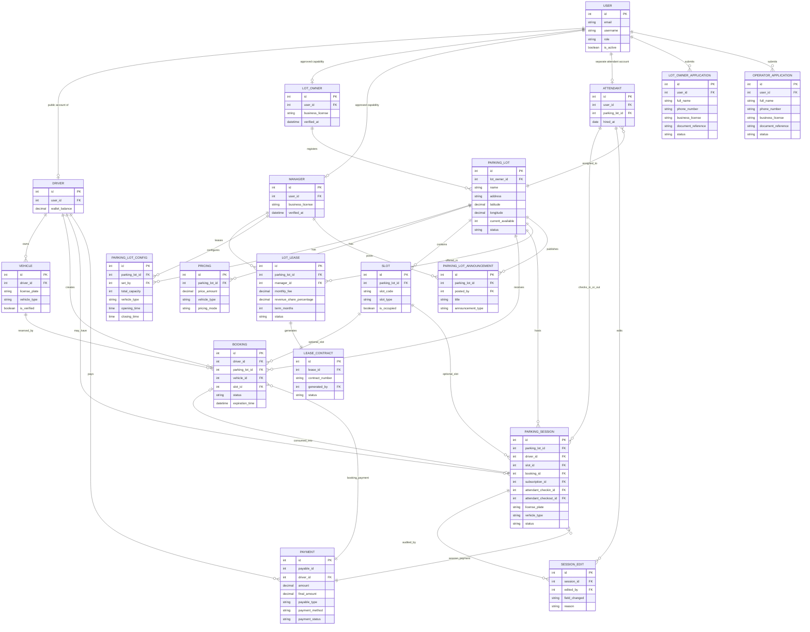
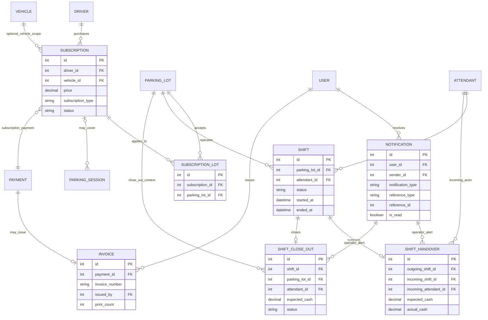

# ERD As-Built Của Ứng Dụng

## Mục tiêu

ERD này bám theo SQLAlchemy models hiện có trong backend. Nó không lặp lại toàn bộ bảng generic của boilerplate như `post`, `tier`, `rate_limit`, mà tập trung vào schema domain của smart parking.

## Cách đọc

- Phần 1 là ERD lõi cho các flow đang chi phối mobile app hiện tại.
- Phần 2 là ERD mở rộng cho subscription, notification, invoice và shift operations đã có schema.
- Nếu planning docs khác code, ưu tiên code hiện tại là nguồn chuẩn của tài liệu này.

## ERD lõi

## ERD mở rộng

## Điểm khác với ERD cũ cần lưu ý

| Chủ đề | ERD cũ | As-built hiện tại |
|---|---|---|
| `ParkingLot.status` | Thường được diễn giải như `ACTIVE/SUSPENDED` ở doc nghiệp vụ | Enum model hiện tại là `PENDING`, `APPROVED`, `REJECTED`, `CLOSED` |
| `Booking.status` | Một số doc chỉ nêu `PENDING/CONFIRMED/EXPIRED` | Model hiện tại có `PENDING`, `CONFIRMED`, `CONSUMED`, `EXPIRED`, `CANCELLED` |
| `ParkingSession.status` | Tài liệu cũ có `CHECKED_IN/CHECKED_OUT` | Model hiện tại là `CHECKED_IN`, `CHECKED_OUT`, `TIMEOUT` |
| `PaymentMethod` | Tài liệu cũ mở rộng nhiều kiểu | Model hiện tại chỉ là `CASH` và `ONLINE` |
| Subscription | Bị xem là Phase 2 trong workflow docs | Schema đã có bảng `subscription` và `subscription_lot`, nhưng mobile MVP chưa dùng mạnh |
| Shift close-out | Chưa luôn xuất hiện trong ERD cũ | Schema và test backend đã có đủ `shift`, `shift_handover`, `shift_close_out` |

## Kết luận ngắn

- Nếu cần mô tả database đang tồn tại trong backend, hãy dùng ERD as-built này.
- Nếu cần mô tả phạm vi thesis demo hiện tại, hãy đọc thêm [workflow-truth-map](_bmad-output/planning-artifacts/workflow-truth-map.md) song song với ERD này để tách rõ phần có schema và phần thực sự được đưa vào flow chính.