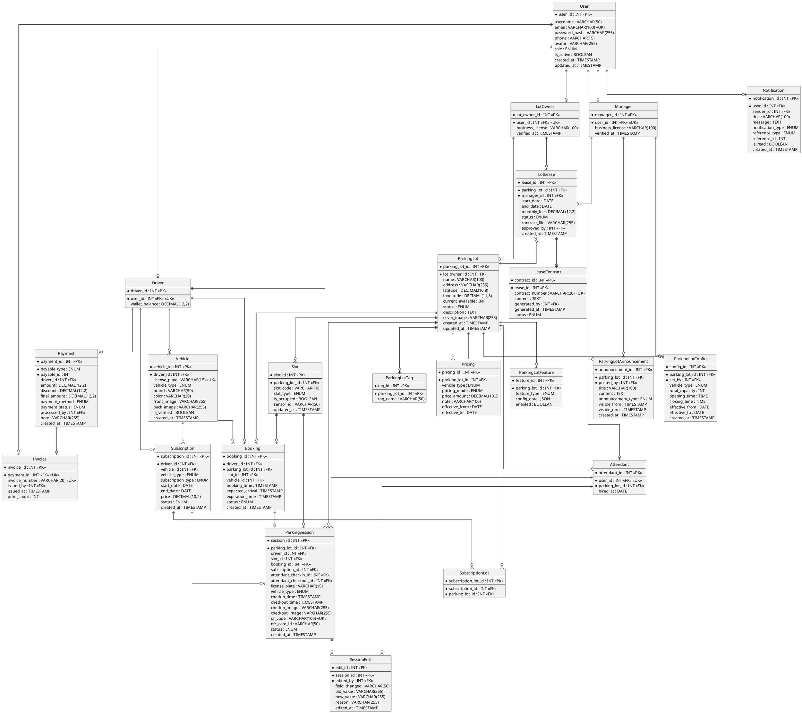

# ERD - Hệ thống Quản lý Bãi xe Thông minh

## Tổng quan thiết kế

Thiết kế đạt chuẩn **BCNF/4NF** để đảm bảo:
- Không dư thừa dữ liệu
- Mỗi thuộc tính phụ thuộc hoàn toàn vào khóa chính
- Không có phụ thuộc bắc cầu
- Không có phụ thuộc đa trị

## Danh sách Entity (22 bảng)

> **Ghi chú chuẩn hoá:** thiết kế đạt BCNF/4NF. Các thuộc tính “tạm thời theo thời điểm” của bãi xe (sức chứa, giờ, loại xe) được tách ra bảng `ParkingLotConfig` có ngày hiệu lực. `current_available` được giữ lại như một *denormalized cache* có chủ ý để phục vụ truy vấn realtime.

### 1. User (Người dùng)
| Thuộc tính | Kiểu | Mô tả |
|------------|------|-------|
| user_id | INT | PK |
| username | VARCHAR(50) | Tên đăng nhập |
| email | VARCHAR(100) | Email (UNIQUE) |
| password_hash | VARCHAR(255) | Mật khẩu mã hóa |
| phone | VARCHAR(15) | Số điện thoại |
| avatar | VARCHAR(255) | Ảnh đại diện |
| role | ENUM | DRIVER, ATTENDANT, MANAGER, LOT_OWNER, ADMIN |
| is_active | BOOLEAN | Trạng thái hoạt động |
| created_at | TIMESTAMP | Ngày tạo |
| updated_at | TIMESTAMP | Ngày cập nhật |

### 2. Driver (Tài xế - kế thừa User)
| Thuộc tính | Kiểu | Mô tả |
|------------|------|-------|
| driver_id | INT | PK |
| user_id | INT | FK → User (UNIQUE) |
| wallet_balance | DECIMAL(12,2) | Số dư ví |

### 3. LotOwner (Chủ cho thuê bãi xe - kế thừa User)
| Thuộc tính | Kiểu | Mô tả |
|------------|------|-------|
| lot_owner_id | INT | PK |
| user_id | INT | FK → User (UNIQUE) |
| business_license | VARCHAR(100) | Giấy phép kinh doanh / sở hữu |
| verified_at | TIMESTAMP | Ngày xác minh |

### 4. Manager (Quản lý bãi xe / Operator - kế thừa User)
| Thuộc tính | Kiểu | Mô tả |
|------------|------|-------|
| manager_id | INT | PK |
| user_id | INT | FK → User (UNIQUE) |
| business_license | VARCHAR(100) | Giấy phép kinh doanh |
| verified_at | TIMESTAMP | Ngày xác minh |

### 5. Attendant (Nhân viên - kế thừa User)
| Thuộc tính | Kiểu | Mô tả |
|------------|------|-------|
| attendant_id | INT | PK |
| user_id | INT | FK → User (UNIQUE) |
| parking_lot_id | INT | FK → ParkingLot |
| hired_at | DATE | Ngày vào làm |

### 6. Vehicle (Xe của tài xế)
| Thuộc tính | Kiểu | Mô tả |
|------------|------|-------|
| vehicle_id | INT | PK |
| driver_id | INT | FK → Driver |
| license_plate | VARCHAR(15) | Biển số (UNIQUE) |
| vehicle_type | ENUM | MOTORBIKE, CAR |
| brand | VARCHAR(50) | Hãng xe |
| color | VARCHAR(20) | Màu xe |
| front_image | VARCHAR(255) | Ảnh mặt trước |
| back_image | VARCHAR(255) | Ảnh mặt sau |
| is_verified | BOOLEAN | Đã xác minh |
| created_at | TIMESTAMP | Ngày tạo |

### 7. ParkingLot (Bãi xe — thông tin cố định)
| Thuộc tính | Kiểu | Mô tả |
|------------|------|-------|
| parking_lot_id | INT | PK |
| lot_owner_id | INT | FK → LotOwner |
| name | VARCHAR(100) | Tên bãi |
| address | VARCHAR(255) | Địa chỉ |
| latitude | DECIMAL(10,8) | Vĩ độ |
| longitude | DECIMAL(11,8) | Kinh độ |
| current_available | INT | Số chỗ trống (*cache*, cập nhật qua trigger/service) |
| status | ENUM | PENDING, APPROVED, REJECTED, CLOSED |
| description | TEXT | Mô tả |
| cover_image | VARCHAR(255) | Ảnh bìa |
| created_at | TIMESTAMP | Ngày tạo |
| updated_at | TIMESTAMP | Ngày cập nhật |

### 8. ParkingLotConfig (Cấu hình bãi xe — thông tin tạm thời theo thời điểm)
| Thuộc tính | Kiểu | Mô tả |
|------------|------|-------|
| config_id | INT | PK |
| parking_lot_id | INT | FK → ParkingLot |
| set_by | INT | FK → Manager (Operator thiết lập) |
| vehicle_type | ENUM | MOTORBIKE, CAR, ALL |
| total_capacity | INT | Tổng số chỗ hiệu lực |
| opening_time | TIME | Giờ mở cửa |
| closing_time | TIME | Giờ đóng cửa |
| effective_from | DATE | Ngày hiệu lực |
| effective_to | DATE | Ngày hết hiệu lực (NULL = đang hiệu lực) |
| created_at | TIMESTAMP | Ngày tạo |

> **Quy tắc:** tại một thời điểm chỉ có đúng 1 bản config có `effective_to IS NULL` cho mỗi bãi xe. Khi Operator cập nhật: đóng bản cũ (`effective_to = today`) và tạo bản mới.

### 9. LotLease (Hợp đồng thuê bãi xe)
| Thuộc tính | Kiểu | Mô tả |
|------------|------|-------|
| lease_id | INT | PK |
| parking_lot_id | INT | FK → ParkingLot |
| manager_id | INT | FK → Manager |
| start_date | DATE | Ngày bắt đầu thuê |
| end_date | DATE | Ngày kết thúc thuê |
| monthly_fee | DECIMAL(12,2) | Phí thuê hàng tháng |
| status | ENUM | PENDING, ACTIVE, EXPIRED, TERMINATED |
| contract_file | VARCHAR(255) | File hợp đồng (URL) |
| approved_by | INT | FK → User (Admin duyệt, nullable) |
| created_at | TIMESTAMP | Ngày tạo |

### 23. LeaseContract (Hợp đồng cho thuê)
| Thuộc tính | Kiểu | Mô tả |
|------------|------|-------|
| contract_id | INT | PK |
| lease_id | INT | FK → LotLease (UNIQUE) |
| contract_number | VARCHAR(20) | Số hợp đồng (UNIQUE) |
| content | TEXT | Nội dung hợp đồng (HTML) |
| generated_by | INT | FK → User (Admin duyệt) |
| generated_at | TIMESTAMP | Ngày tạo hợp đồng |
| status | ENUM | DRAFT, ACTIVE, EXPIRED |

### 10. ParkingLotFeature (Tính năng bãi xe)
| Thuộc tính | Kiểu | Mô tả |
|------------|------|-------|
| feature_id | INT | PK |
| parking_lot_id | INT | FK → ParkingLot |
| feature_type | ENUM | CAMERA, IOT, SLOT_MANAGEMENT, BARRIER |
| config_data | JSON | Cấu hình chi tiết |
| enabled | BOOLEAN | Đang bật |

### 11. ParkingLotTag (Tag bãi xe)
| Thuộc tính | Kiểu | Mô tả |
|------------|------|-------|
| tag_id | INT | PK |
| parking_lot_id | INT | FK → ParkingLot |
| tag_name | VARCHAR(50) | Tên tag |

### 12. Slot (Ô đỗ xe)
| Thuộc tính | Kiểu | Mô tả |
|------------|------|-------|
| slot_id | INT | PK |
| parking_lot_id | INT | FK → ParkingLot |
| slot_code | VARCHAR(10) | Mã ô (A01, B12...) |
| slot_type | ENUM | STANDARD, VIP, DISABLED |
| is_occupied | BOOLEAN | Đang có xe |
| sensor_id | VARCHAR(50) | ID cảm biến IoT |
| updated_at | TIMESTAMP | Cập nhật lần cuối |

### 13. Pricing (Bảng giá)
| Thuộc tính | Kiểu | Mô tả |
|------------|------|-------|
| pricing_id | INT | PK |
| parking_lot_id | INT | FK → ParkingLot |
| vehicle_type | ENUM | MOTORBIKE, CAR, ALL |
| pricing_mode | ENUM | SESSION, HOURLY, DAILY, MONTHLY, CUSTOM |
| price_amount | DECIMAL(10,2) | Giá (ý nghĩa tuỳ pricing_mode) |
| note | VARCHAR(100) | Ghi chú |
| effective_from | DATE | Ngày hiệu lực |
| effective_to | DATE | Ngày hết hạn |

### 14. Subscription (Vé tháng/tuần)
| Thuộc tính | Kiểu | Mô tả |
|------------|------|-------|
| subscription_id | INT | PK |
| driver_id | INT | FK → Driver |
| vehicle_id | INT | FK → Vehicle (nullable — áp dụng cho xe cụ thể) |
| vehicle_type | ENUM | MOTORBIKE, CAR (đãt loại xe) |
| subscription_type | ENUM | WEEKLY, MONTHLY |
| start_date | DATE | Ngày bắt đầu |
| end_date | DATE | Ngày kết thúc |
| price | DECIMAL(10,2) | Giá vé |
| status | ENUM | ACTIVE, EXPIRED, CANCELLED |
| created_at | TIMESTAMP | Ngày tạo |

### 15. SubscriptionLot (Vé áp dụng cho bãi)
| Thuộc tính | Kiểu | Mô tả |
|------------|------|-------|
| subscription_lot_id | INT | PK |
| subscription_id | INT | FK → Subscription |
| parking_lot_id | INT | FK → ParkingLot |

### 16. Booking (Đặt chỗ trước)
| Thuộc tính | Kiểu | Mô tả |
|------------|------|-------|
| booking_id | INT | PK |
| driver_id | INT | FK → Driver |
| parking_lot_id | INT | FK → ParkingLot |
| slot_id | INT | FK → Slot (nullable) |
| vehicle_id | INT | FK → Vehicle |
| booking_time | TIMESTAMP | Thời gian đặt |
| expected_arrival | TIMESTAMP | Dự kiến đến |
| expiration_time | TIMESTAMP | Thời gian hết hạn |
| status | ENUM | PENDING, CONFIRMED, EXPIRED, CANCELLED |
| created_at | TIMESTAMP | Ngày tạo |

### 17. ParkingSession (Phiên gửi xe)
| Thuộc tính | Kiểu | Mô tả |
|------------|------|-------|
| session_id | INT | PK |
| parking_lot_id | INT | FK → ParkingLot |
| driver_id | INT | FK → Driver (nullable) |
| slot_id | INT | FK → Slot (nullable) |
| booking_id | INT | FK → Booking (nullable) |
| subscription_id | INT | FK → Subscription (nullable) |
| attendant_checkin_id | INT | FK → Attendant (nullable) |
| attendant_checkout_id | INT | FK → Attendant (nullable) |
| license_plate | VARCHAR(15) | Biển số thực tế |
| vehicle_type | ENUM | Loại xe |
| checkin_time | TIMESTAMP | Giờ vào |
| checkout_time | TIMESTAMP | Giờ ra (nullable) |
| checkin_image | VARCHAR(255) | Ảnh chụp lúc vào |
| checkout_image | VARCHAR(255) | Ảnh chụp lúc ra |
| qr_code | VARCHAR(100) | Mã QR (UNIQUE) |
| nfc_card_id | VARCHAR(50) | ID thẻ NFC (nullable) |
| status | ENUM | CHECKED_IN, CHECKED_OUT |
| created_at | TIMESTAMP | Ngày tạo |

### 18. SessionEdit (Lịch sử chỉnh sửa session)
| Thuộc tính | Kiểu | Mô tả |
|------------|------|-------|
| edit_id | INT | PK |
| session_id | INT | FK → ParkingSession |
| edited_by | INT | FK → Attendant |
| field_changed | VARCHAR(50) | Trường được sửa |
| old_value | VARCHAR(255) | Giá trị cũ |
| new_value | VARCHAR(255) | Giá trị mới |
| reason | VARCHAR(255) | Lý do chỉnh sửa |
| edited_at | TIMESTAMP | Thời gian sửa |

### 19. Payment (Thanh toán)
| Thuộc tính | Kiểu | Mô tả |
|------------|------|-------|
| payment_id | INT | PK |
| payable_type | ENUM | SESSION, SUBSCRIPTION, BOOKING |
| payable_id | INT | ID của entity được thanh toán |
| driver_id | INT | FK → Driver |
| amount | DECIMAL(12,2) | Số tiền gốc |
| discount | DECIMAL(12,2) | Giảm giá |
| final_amount | DECIMAL(12,2) | Số tiền cuối |
| payment_method | ENUM | CASH, ONLINE |
| payment_status | ENUM | PENDING, COMPLETED, FAILED |
| processed_by | INT | FK → User (nullable) |
| note | VARCHAR(255) | Ghi chú |
| created_at | TIMESTAMP | Ngày tạo |

### 20. Invoice (Hoá đơn)
| Thuộc tính | Kiểu | Mô tả |
|------------|------|-------|
| invoice_id | INT | PK |
| payment_id | INT | FK → Payment (UNIQUE) |
| invoice_number | VARCHAR(20) | Số hoá đơn (UNIQUE) |
| issued_by | INT | FK → User |
| issued_at | TIMESTAMP | Ngày xuất |
| print_count | INT | Số lần in |

### 21. ParkingLotAnnouncement (Thông báo bãi xe)
| Thuộc tính | Kiểu | Mô tả |
|------------|------|-------|
| announcement_id | INT | PK |
| parking_lot_id | INT | FK → ParkingLot |
| posted_by | INT | FK → Manager |
| title | VARCHAR(100) | Tiêu đề |
| content | TEXT | Nội dung |
| announcement_type | ENUM | EVENT, TRAFFIC_ALERT, PEAK_HOURS, CLOSURE, GENERAL |
| visible_from | TIMESTAMP | Hiển thị từ |
| visible_until | TIMESTAMP | Hết hiển thị (nullable) |
| created_at | TIMESTAMP | Ngày tạo |

### 22. Notification (Thông báo hệ thống)
| Thuộc tính | Kiểu | Mô tả |
|------------|------|-------|
| notification_id | INT | PK |
| user_id | INT | FK → User (người nhận) |
| sender_id | INT | FK → User (nullable) |
| title | VARCHAR(100) | Tiêu đề |
| message | TEXT | Nội dung |
| notification_type | ENUM | BOOKING_EXPIRING, SUBSCRIPTION_EXPIRING, PAYMENT_SUCCESS, LOT_CLOSING, SYSTEM_ALERT |
| reference_type | ENUM | BOOKING, SESSION, SUBSCRIPTION, LOT |
| reference_id | INT | ID entity liên quan |
| is_read | BOOLEAN | Đã đọc |
| created_at | TIMESTAMP | Ngày tạo |

---

## Sơ đồ ERD (PlantUML)



---

## Quan hệ chính

| Quan hệ | Loại | Mô tả |
|---------|------|-------|
| User → Driver/LotOwner/Manager/Attendant | 1:1 | Kế thừa (Class Table Inheritance) |
| Driver → Vehicle | 1:N | 1 tài xế có nhiều xe |
| LotOwner → ParkingLot | 1:N | 1 chủ cho thuê sở hữu nhiều bãi vật lý |
| LotOwner + Manager → LotLease | N:M | Hợp đồng thuê bãi xe |
| LotLease → ParkingLot | N:1 | 1 bãi có thể cho nhiều Manager thuê (theo kỳ) |
| ParkingLot → ParkingLotConfig | 1:N | Lịch sử cấu hình theo thời điểm (1 active: effective_to IS NULL) |
| ParkingLot → Slot | 1:N | 1 bãi có nhiều ô đỗ |
| Manager → ParkingLotAnnouncement | 1:N | 1 manager đăng nhiều thông báo |
| Subscription → Vehicle | N:1 | Vé gắn với loại xe / xế cụ thể (nullable) |
| Subscription → SubscriptionLot → ParkingLot | N:M | Vé tháng áp dụng nhiều bãi |
| Booking → ParkingSession | 1:0..1 | Đặt chỗ có thể thành phiên gửi |
| ParkingSession → Payment | 1:0..1 | 1 phiên tối đa 1 thanh toán |
| Payment → Invoice | 1:0..1 | 1 thanh toán có thể xuất hoá đơn |

---

## Index đề xuất

```sql
-- Tìm kiếm bãi xe theo vị trí
CREATE INDEX idx_lot_location ON ParkingLot(latitude, longitude);

-- Thống kê xe trong bãi realtime
CREATE INDEX idx_session_status ON ParkingSession(parking_lot_id, status, checkin_time);

-- Query slot trống
CREATE INDEX idx_slot_available ON Slot(parking_lot_id, is_occupied);

-- Check booking hết hạn
CREATE INDEX idx_booking_expiry ON Booking(parking_lot_id, status, expiration_time);

-- Tìm kiếm theo biển số
CREATE INDEX idx_vehicle_plate ON Vehicle(license_plate);
CREATE INDEX idx_session_plate ON ParkingSession(license_plate);
```
