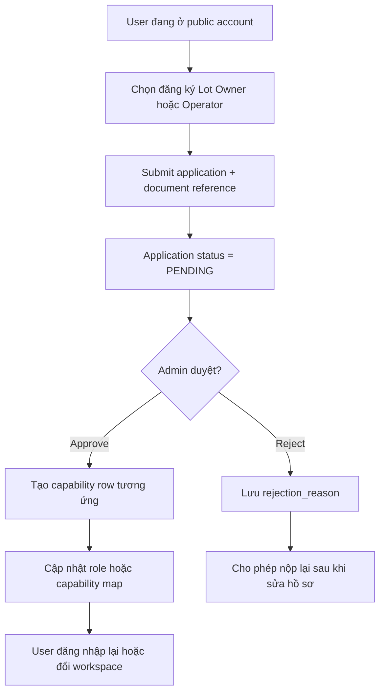
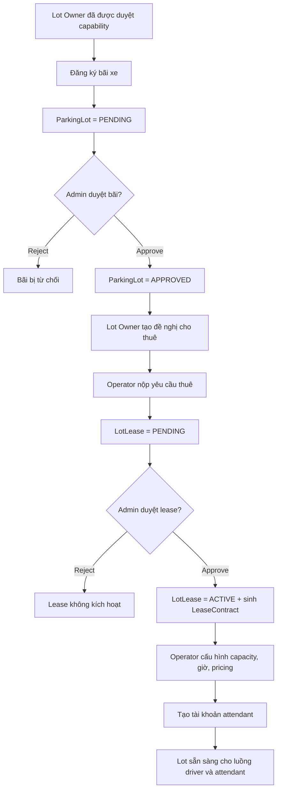
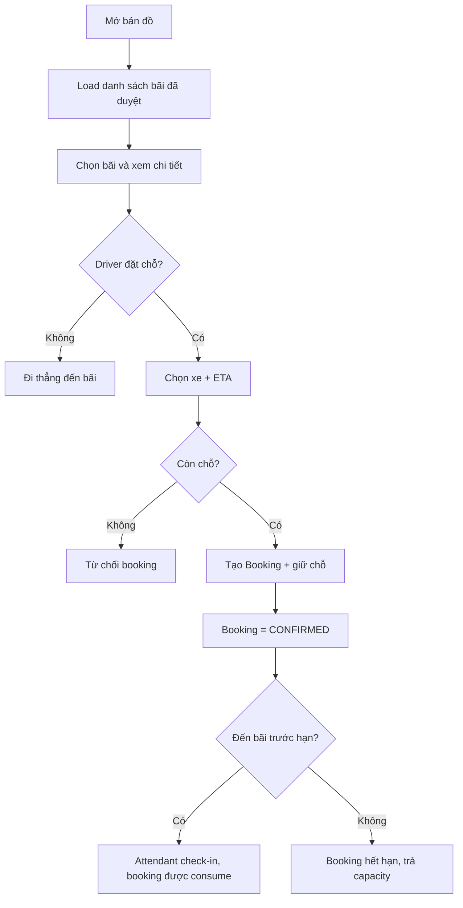
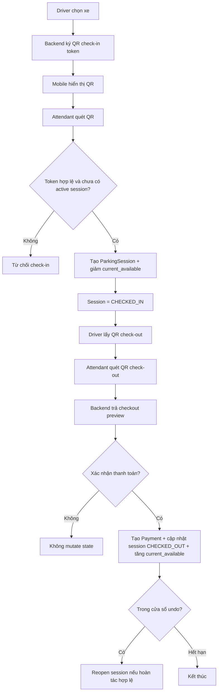
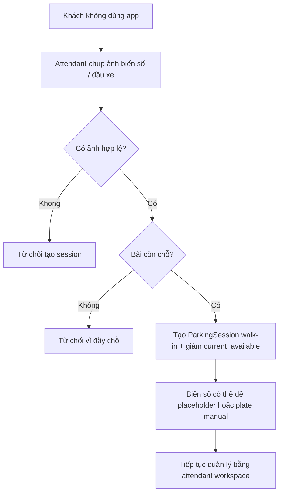
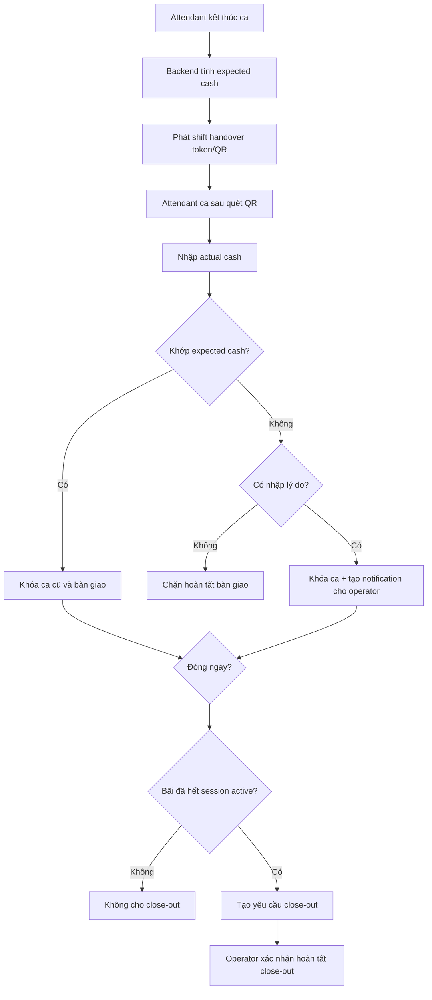

# Flowchart Các Luồng Hoạt Động Chính

## Mục tiêu

Tài liệu này vẽ lại các luồng vận hành quan trọng nhất của app theo kiểu as-built: ưu tiên logic đang có trong backend/mobile hiện tại, đồng thời đánh dấu rõ những điểm vẫn còn gap hoặc placeholder trên UI.

## 1. Capability application và cấp workspace

Lưu ý:

- Capability không được gắn trực tiếp chỉ bằng field `role`; backend còn giữ riêng bảng `lot_owner`, `manager`, `lot_owner_application`, `operator_application`.
- Attendant và Admin là nhánh account riêng, không đi qua public capability flow này.

## 2. Chuỗi làm bãi xe đi vào trạng thái khai thác

Lưu ý:

- Workflow docs thường gọi trạng thái lot “live” là `ACTIVE`, nhưng enum `parking_lot.status` ở model hiện tại vẫn là `APPROVED/CLOSED`. Trạng thái “sẵn sàng vận hành” thực tế là kết quả tổng hợp của approval + lease active + config hiện hành.
- Mobile shell của Admin, Operator, Lot Owner hiện chưa hoàn thiện toàn bộ tab phụ, nên một phần thao tác vẫn thiên về screen chính hoặc backend contract hơn là full UI coverage.

## 3. Driver tìm bãi và đặt chỗ

Lưu ý:

- Availability trên map có luồng realtime qua WebSocket cho lot đang được quan tâm.
- Booking là biên giữ chỗ tạm thời, không phải `ParkingSession`. Session chỉ sinh ra khi attendant thực hiện check-in.

## 4. Core parking loop bằng QR

Lưu ý:

- Check-out preview và finalize là hai bước tách biệt. Preview không được mutate state.
- Finalize có logic chống double finalize, stale preview và rollback khi commit lỗi.

## 5. Attendant walk-in check-in

Lưu ý:

- Walk-in check-in đã có backend contract và test.
- Walk-in check-out end-to-end vẫn là vùng cần chốt thêm trong demo scope; workflow-truth-map cũng đánh dấu đây là điểm chưa rõ của MVP.

## 6. Handover ca và close-out cuối ngày

Lưu ý:

- Shift handover và final close-out đã có schema và test backend.
- Đây là flow vận hành mạnh ở backend, nhưng không phải phần được thể hiện đầy đủ nhất trên mobile so với core check-in/out.

## Những gap nên giữ nguyên trong tài liệu demo

| Chủ đề | Trạng thái nên mô tả |
|---|---|
| Offline pending sync cho attendant | Chưa có trong flow chạy thật, không nên mô tả như đã triển khai |
| Walk-in check-out credential | Chưa chốt rõ end-to-end, nên đánh dấu là giới hạn MVP |
| Admin Users/Parking Lots tab | Có shell nhưng UI còn mỏng hoặc placeholder |
| Lot Owner contracts/profile tab | Có hướng nghiệp vụ nhưng UI chưa đầy đủ |
| Multi-lot picker cho operator | Cần giải thích như một điểm còn có thể mở rộng |