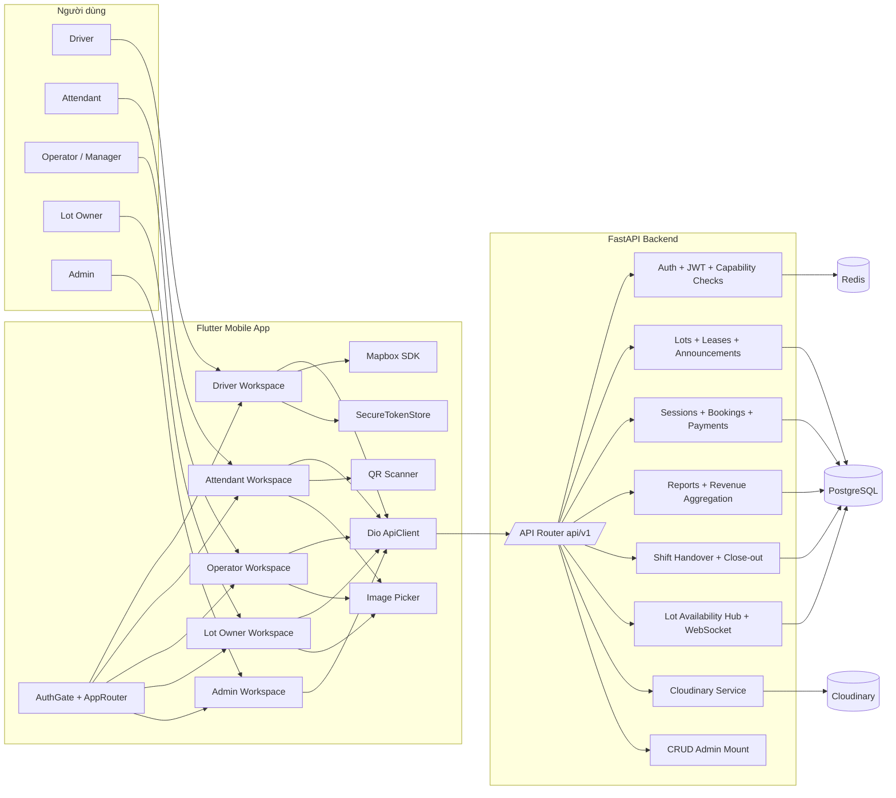
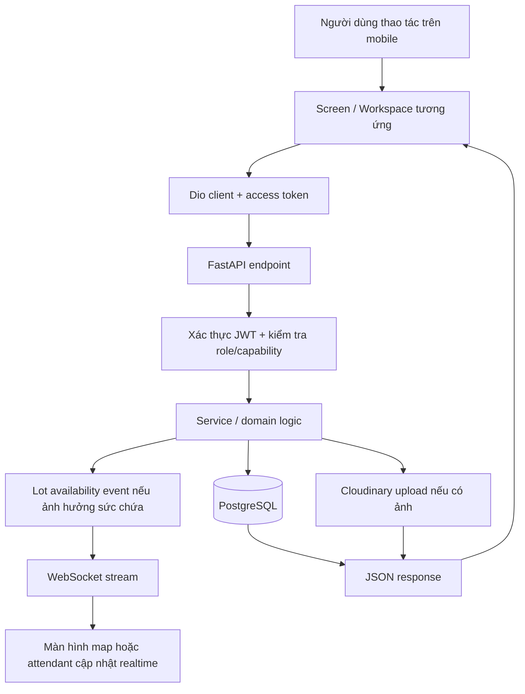

# Kiến Trúc Hệ Thống As-Built

## Mục tiêu

Tài liệu này mô tả kiến trúc đang được app hiện tại sử dụng, ưu tiên bám code hơn là bám planning docs. Mục đích là để nhìn nhanh được mối quan hệ giữa frontend, backend, database và các dịch vụ phụ trợ đang tham gia vào runtime.

## Phạm vi thực tế hiện tại

- Frontend hiện tại là ứng dụng Flutter đa workspace cho Driver, Attendant, Operator, Lot Owner và Admin.
- Backend hiện tại là FastAPI monolith có chia router theo domain, không phải microservice.
- PostgreSQL là nguồn dữ liệu chuẩn cho nghiệp vụ parking.
- Redis có trong cấu hình hệ thống cho blacklist refresh token, cache và rate limiting, nhưng realtime lot availability hiện đang được phát qua WebSocket với in-memory hub ở backend.
- Media upload hiện đi qua backend rồi lưu ra Cloudinary.
- Không có web frontend riêng trong repo hiện tại.

## Sơ đồ tổng quan

## Cách hệ thống chạy trong thực tế

## Phân rã theo lớp

| Lớp | Thành phần chính | Vai trò |
|---|---|---|
| Presentation | Flutter screens, workspace shells, AuthGate | Điều hướng theo role, hiển thị luồng nghiệp vụ cho từng actor |
| Client integration | Dio ApiClient, SecureTokenStore, env loader | Gọi API, giữ access/refresh token, nạp `API_BASE_URL` và Mapbox token |
| API layer | FastAPI routers `auth`, `users`, `lots`, `sessions`, `bookings`, `reports`, `payments`, `shifts` | Biên vào nghiệp vụ, kiểm tra quyền và schema request/response |
| Domain services | Auth/JWT, lot availability hub, shift service, Cloudinary service | Chứa logic dùng chung và orchestration theo nghiệp vụ |
| Persistence | SQLAlchemy async models + Alembic | Lưu schema nghiệp vụ và migration |
| External utils | PostgreSQL, Redis, Cloudinary, Mapbox | Dữ liệu chuẩn, blacklist/cache, media hosting, bản đồ |

## Mapping frontend sang backend

| Frontend concern | Backend concern | Ghi chú |
|---|---|---|
| Đăng nhập, restore session | `auth`, `login`, `logout`, `users/me` | Quyết định route shell bằng `role` và `capabilities` |
| Driver tìm bãi trên map | `lots` + availability WebSocket | Mapbox ở mobile, dữ liệu chuẩn lấy từ backend |
| Driver tạo QR check-in/check-out | `sessions` | Token QR được backend ký, mobile chỉ render |
| Attendant scan QR, walk-in, checkout | `sessions`, `payments`, `shifts` | Backend là nơi tạo `ParkingSession`, tính tiền và chống double mutation |
| Operator cấu hình bãi, tạo nhân viên, xem doanh thu | `lots`, `leases`, `reports`, `users` | Hiện UI đã có phần chính cho lot management, vài tab vẫn placeholder |
| Lot Owner đăng ký bãi, đăng hợp đồng cho thuê, xem doanh thu | `lots`, `leases`, `reports` | Contracts/Profile tab ở mobile còn chưa hoàn thiện hết |
| Admin duyệt hồ sơ | `users`, `lots`, `leases` | Shell admin có approval flow chạy được, Users/Parking Lots tab còn mỏng |

## Những điểm cần đọc đúng

- Đây là kiến trúc monolith theo domain modules, không phải nhiều service tách biệt.
- Realtime availability hiện là WebSocket từ backend, nhưng cơ chế publish nội bộ hiện chưa đi qua Redis pub/sub.
- Mobile đang là client chính của hệ thống. Nhiều flow được thiết kế cho thesis demo nên một số tab chưa đầy đủ, nhưng backend contract cho core parking loop đã khá rõ.
- Trong schema vẫn có các bảng cho subscription, invoice, notification và shift close-out. Chúng phản ánh hướng mở rộng của app, nhưng không phải phần nào cũng đang được bộc lộ đầy đủ trên UI mobile hiện tại.